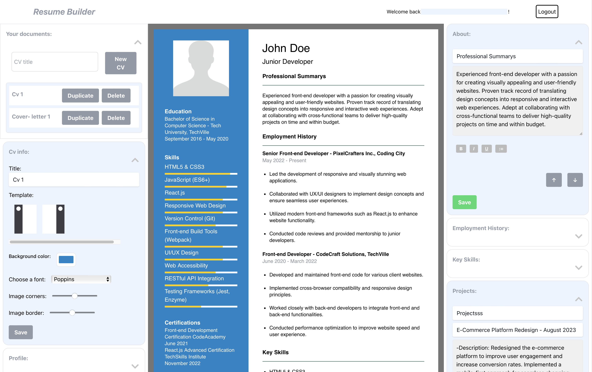

# Resume Builder

## Create, Manage, Edit & Download your documents

[Online Demo](https://resume-builder-preview.netlify.app/)

### See the changes you make apply instantly to the preview. When satisfied with result you can save the modified section.

- Built with React
- Back-end uses serverless Netlify functions
- Authentication using Netlify Identity
- Login using multiple options
- Persists data to FaunaDB
- Photos upload to Cloudinary
- Document manager
- Multiple templates
- Draft section
- Users only access their own documnents
- Some sections content can be extended
- Activate and deactivate the sections
- Reorder the sections
- Download Pdf
- Uses TailwindCSS

### Get the necessary environment variables

### `npm install`

### `npm run dev`

Runs the app in the development mode.\
Open [http://localhost:9999](http://localhost:9999) to view it in your browser.
